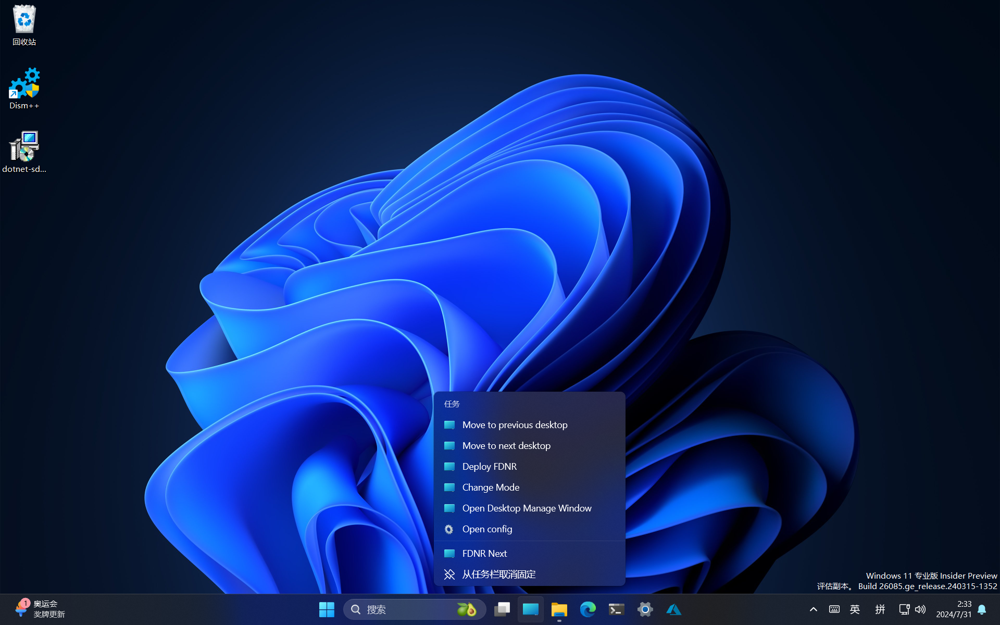

# FDNR - FishDeskNext: Reborn

[](https://github.com/liziyu0714/FishDeskNextReborn/actions/workflows/dotnet-desktop.yml)

> 写更多Next，不止于切换桌面。
> ——liziyu0714
> 
> 我首先反驳“OOB不能为任务所驱动”的刁钻说法；譬如FDNR便是个有利反驳。
> ——幸草_Tarikko-ScetayhChan

本项目将在未来被重新命名——正因为不至于切换桌面。

## 前言

现在想象你是位学生开发者，你正在教室电脑上使用VS Code流畅地码着`unsafe`，准备为你的某个程序添加一些精妙的功能。你无意间回头，发现班主任正站在窗外看着黑漆漆的窗口，随时都要走进门惟你是问……

这类情况可不少见。无论是起兴玩着PVZ，编译LLVM，滚~~挂~~Arch Linux或Gentoo，还是仅仅拷贝上节课的课件，被老师发现都在所难免。

为了减少这些窘迫的情况，**FishDeskNext: Reborn**（FDNR）应运而生。

## 原理

使用Windows 10/11的任务视图可以完美地隐蔽窗口。然而，想要在基于触控的教室电脑上启动任务视图，点按图标或者右划屏幕左边缘的效率极低，一不小心就会被老师发现。

作为FDNR的前身，**FishDeskNext**（FDN）模拟`Ctrl`键+`Windows徽标`键+`Right`键来切换到下一个桌面，显著解决了上述问题；同时，所有窗口都会被最小化，这意味着即使你已处于最后一个桌面，窗口也会被隐藏。

基于FDN，我开发了FishDeskNext: Reborn，并加入了JumpList（跳转列表）功能。当应用程序图标被固定到任务栏时，右击（即触控下的长按）该图标即可唤出跳转列表。用户可以点按菜单中的按钮切换回上一个桌面，继续你的工作。

## 编译安装

先决条件：

- 操作系统环境：Windows 7及以上（[x86](https://www.microsoft.com/zh-cn/software-download/)、[x64](https://www.microsoft.com/zh-cn/software-download/)或ARM64架构）
- 编译环境：.NET 8.0 SDK([x86](https://dotnet.microsoft.com/zh-cn/download/dotnet/thank-you/sdk-8.0.303-windows-x86-installer)、[x64](https://dotnet.microsoft.com/zh-cn/download/dotnet/thank-you/sdk-8.0.303-windows-x64-installer)或[ARM64](https://dotnet.microsoft.com/zh-cn/download/dotnet/thank-you/sdk-8.0.303-windows-arm64-installer)架构)

使用[Git](https://registry.npmmirror.com/-/binary/git-for-windows/v2.46.0.windows.1/Git-2.46.0-64-bit.exe)克隆本仓库或下载解压[`.zip`文件](https://github.com/liziyu0714/FishDeskNextReborn/archive/refs/heads/master.zip)：

```powershell
git clone https://github.com/liziyu0714/FishDeskNextReborn.git
```

切换路径：

```powershell
cd .\FishDeskNextReborn\
```

发布：

```powershell
dotnet publish
```

编译产物位于`.\src\FishDeskNextReborn\bin\Release\net8.0-windows\`下。

将所有编译产物复制到合适的地方，例如`~\Documents\FDNR\`：

```powershell
# 创建~\Documents\FDNR目录
mkdir ~\Documents\FDNR\

# 将所有编译产物复制到~\Documents\FDNR目录下
copy .\src\FishDeskNextReborn\bin\Release\net8.0-windows\publish\* ~\Documents\FDNR\

# 切换至~\Documents\FDNR目录下
cd ~\Documents\FDNR\

# 检查目录内容
ls
```

## 用法

### GUI

右击（长按）`FishDeskNextReborn.exe`，单击“以管理员身份运行”。

单击“打开部署工具”。

单击“部署快捷方式”。这将在目录下生成五个快捷方式（资源管理器可能不显示`.lnk`拓展名）：

- `FDNR Config.lnk`
- `FDNR Deploy.lnk`
- `FDNR Next.lnk`
- `FDNR Previous.lnk`
- `FDNR Silent Start.lnk`

关闭各窗口。

拖拽`FDNR Next.lnk`以固定到任务栏。

打开任务视图，新建一个或多个桌面。

单击任务栏的FDNR Next图标，即可切换到下一个桌面。

长按任务栏的FDNR Next图标，即可呼出跳转列表。单击“Move to previous desktop”，即可切换到上一个桌面。



### CLI

不传入任何参数时，打开主界面：

```powershell
.\FishDeskNextReborn.exe
```

传入参数`-N`时，切换至下一个桌面：

```powershell
.\FishDeskNextReborn.exe -N
```

传入参数`-P`时，切换至上一个桌面：

```powershell
.\FishDeskNextReborn.exe -P
```

传入参数`-E`时，打开部署工具：

```powershell
.\FishDeskNextReborn.exe -E
```

## 测试

作者本人在7代i5、4 GB RAM硬件上、Windows 10 1709、21H2、23H2 on x64环境下进行了测试。

[幸草_Tarikko-ScetayhChan](https://github.com/Tarikko-ScetayhChan)在Apple M2、4 GB RAM硬件上的Windows 11 23H2 on ARM64虚拟机环境下进行了测试。

编译安装和测试未报告任何问题。

## 展望

- [x] 单实例功能
- [x] 部署工具
- [ ] 更改配色
- [ ] 切换用户（Next Account）
- [ ] 切换会话（Next Session）
- [ ] 全屏动画
- [ ] 自更新
- [ ] 自绘图标（将来可能由[幸草_Tarikko-ScetayhChan](https://github.com/Tarikko-ScetayhChan)绘制）

预计未来还会发布2个FDNR的Releases。

## 关于

FishDeskNext: Reborn采用[GNU通用公共许可证第3版(GPLv3.0)](https://www.gnu.org/licenses/gpl-3.0.html)。

本程序的作者是[liziyu0714](https://github.com/liziyu0714/)。

本文档的主要作者是[liziyu0714](https://github.com/liziyu0714/)和[幸草_Tarikko-ScetayhChan](https://github.com/Tarikko-ScetayhChan)。