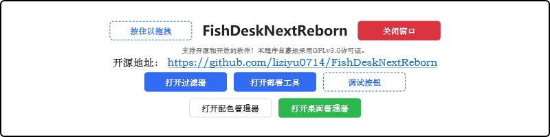
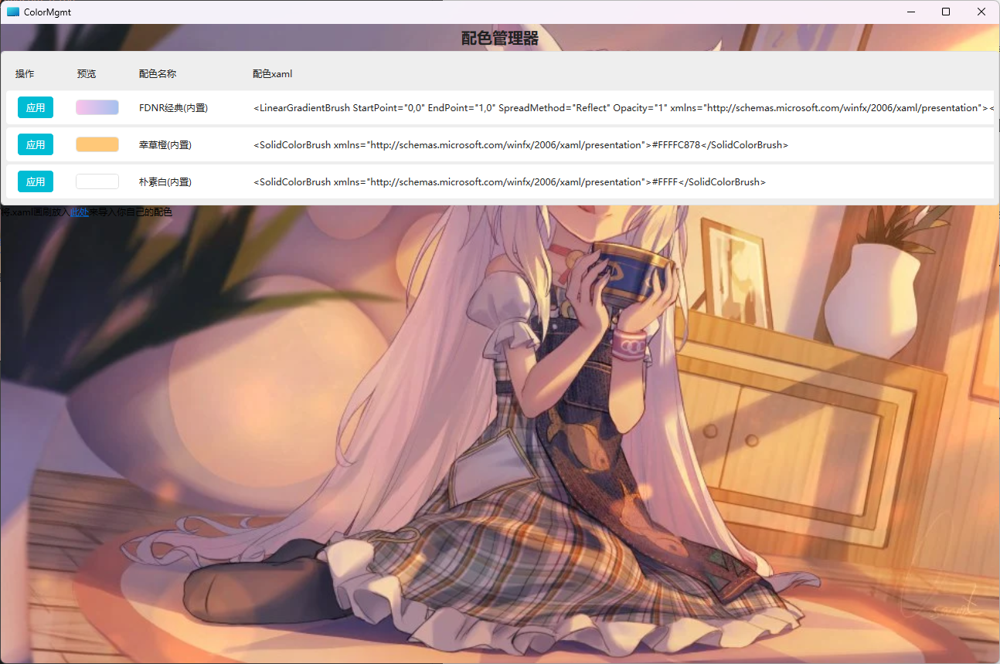

# FDNR 配色管理器文档
FDNR的配色管理除了内置的几种主题以外，还支持任意的xaml文件作为背景画刷.
FDNR会读取 `%APPDATA%/FishDeskNextReborn\Brushes`下的任何文件,并将其文件名作为配色名称显示在配色管理器中.
只有xaml才可以被FDNR正确读取,**注意,在xaml中必须指明xmlns属性,同时不得在文件中携带转义符.**
请将一个[WPF Brush](https://learn.microsoft.com/zh-cn/uwp/api/windows.ui.xaml.media.brush)类型或作为顶级元素写入xaml文件中.当然,你可以使用其他[继承自Brush的类型](https://learn.microsoft.com/zh-cn/dotnet/desktop/wpf/graphics-multimedia/wpf-brushes-overview).
关于编写Brush的教程:[Microsoft Learn](https://learn.microsoft.com/zh-cn/dotnet/desktop/wpf/graphics-multimedia/wpf-brushes-overview#paint-with-a-solid-color).
比如,这是内置的"FDNR经典"配色的xaml文件内容:
``` xaml
<LinearGradientBrush  xmlns="http://schemas.microsoft.com/winfx/2006/xaml/presentation" StartPoint="0,0" EndPoint="1,0" SpreadMethod="Reflect" Opacity="1">
    <LinearGradientBrush.GradientStops><GradientStop Color="#FFFBC2EB" Offset="0" />
    <GradientStop Color="#FFA6C1EE" Offset="1" /></LinearGradientBrush.GradientStops>
</LinearGradientBrush>
```
这是一个线性渐变画刷,可以绘制出FDNR默认的底层渐变蓝紫色.
同理,你也可以创建一个纯色的画刷:
``` xaml
<SolidColorBrush xmlns="http://schemas.microsoft.com/winfx/2006/xaml/presentation">#FFFF</SolidColorBrush>
```
这是一个白色的画刷.


其他的画刷也是可以的,你甚至可以使用图像画刷([ImageBrush](https://learn.microsoft.com/zh-cn/dotnet/api/system.windows.media.imagebrush))
``` xaml
<ImageBrush xmlns="http://schemas.microsoft.com/winfx/2006/xaml/presentation"
            Stretch="None"
            ImageSource="https://t.mwm.moe/pc"/>
```
这使用一张来自[https://t.alcy.cc/](https://t.alcy.cc/)的随机图片作为背景.
